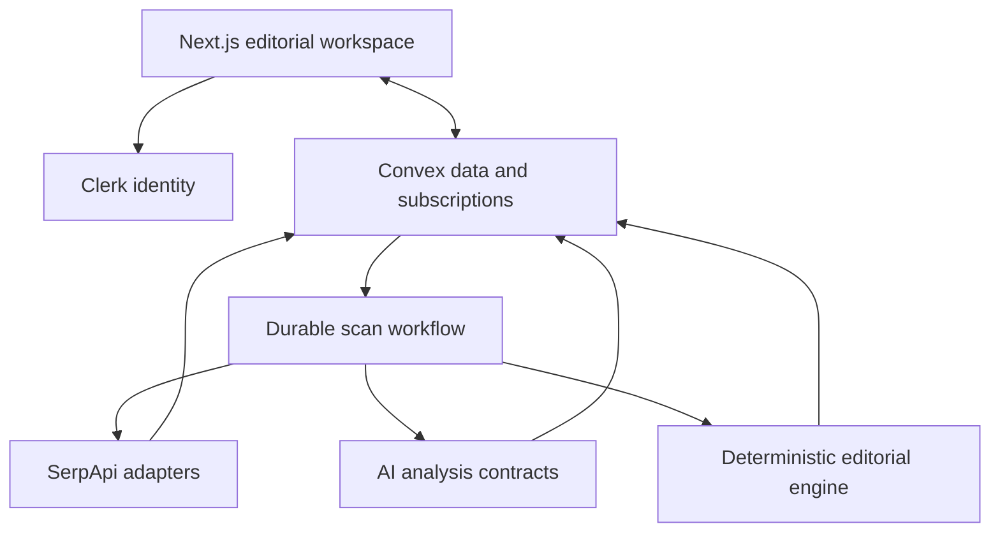
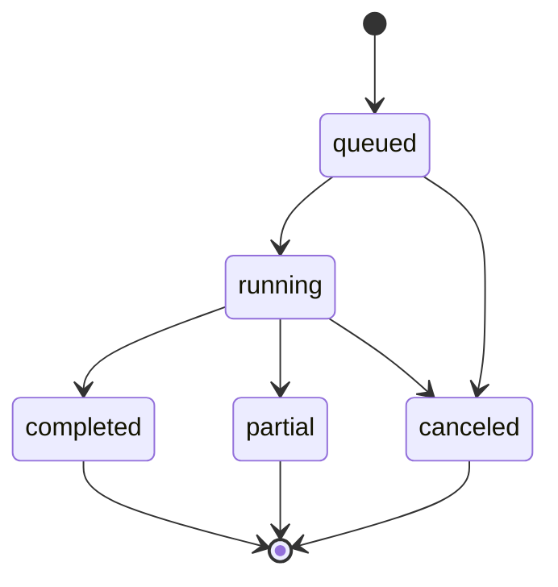

# Technical Spec

## Overview

SignalGap is a source-traceable editorial lead-discovery workspace for small Milwaukee newsrooms and independent reporters. It searches multiple public-web surfaces through SerpApi, connects related signals with AI, applies deterministic editorial rules, and presents a compact ranked feed with an expanded evidence view. It drafts reporting briefs for human review; it does not publish journalism, infer community opinion, or treat AI output as a source.

This specification translates the approved requirements in [prd.md](./prd.md) into a build plan for Claude Code. The implementation optimizes for a reliable hackathon demo without hiding partial failures, search provenance, model behavior, or editorial corrections.

### Product constraints

- Market: City of Milwaukee, plus county developments with a documented city impact.
- Beats: housing and neighborhood development; transportation and access; arts, culture, and neighborhood life.
- Discovery window: seven days.
- Existing-coverage window: 30 days.
- Feed: top 25 eligible leads, followed by pages of 25.
- Search ceiling: 120 SerpApi calls per scan, enforced before each call.
- Evidence gate: at least two independent signal categories; the stricter PRD rule supersedes the earlier feasibility rule that allowed one authoritative primary source alone.
- Coverage-gap gate: successful required coverage pass and no more than two distinct qualifying original local reports.
- Human authority: only an editor can reject, monitor, assign, revise, or publish work derived from a lead.

### Goals

1. Produce at least one real, source-backed Milwaukee lead end to end for the demo.
2. Make SerpApi central to discovery, corroboration, official-record follow-up, coverage review, and optional enrichment.
3. Make every claim, label, score, and brief section inspectable against its source evidence.
4. Use AI for synthesis and semantic work while keeping eligibility, budgets, and label promotion deterministic.
5. Remain usable when an individual search or model call fails.

### Non-goals

- Reddit comment ingestion, Reddit sentiment analysis, or claims about community opinion.
- Automated article writing or publication.
- A complete archive of Reddit or any other source.
- User-configurable markets, beats, source catalogs, scoring weights, or editorial thresholds during the hackathon.
- A vector database, open-ended autonomous web browsing, or a generalized newsroom CRM.
- Treating snippets, translations, social posts, AI summaries, or map listings as confirmed facts without qualifying evidence.

## Stack

| Layer | Choice | Implementation rule | Official documentation |
| --- | --- | --- | --- |
| Web application | Next.js App Router with TypeScript | Server-render the shell where useful; use client components for live Convex subscriptions and interactive evidence panels | [Next.js App Router](https://nextjs.org/docs/app) |
| Component foundation and styling | Tailwind CSS and selected MIT-licensed Untitled UI React components | Manually add only the open-source components SignalGap uses; build the editorial product components locally; map all visual decisions through the charcoal, warm-white, amber, typography, and dark-mode tokens | [Untitled UI components](https://www.untitledui.com/react/components), [Next.js integration](https://www.untitledui.com/react/integrations/nextjs), [theming](https://www.untitledui.com/react/docs/theming) |
| Accessible UI primitives | React Aria through Untitled UI | Retain the supplied keyboard and focus behavior, then verify it in SignalGap's composed screens; interactive components are explicit client boundaries | [Untitled UI accessibility and stack](https://www.untitledui.com/react/docs/introduction), [React Aria](https://react-spectrum.adobe.com/react-aria/) |
| Authentication | Clerk | Protect `/workspace`, `/scans/*`, `/leads/*`, and `/compare`; pass Clerk identity to Convex and enforce ownership again in every public Convex function | [Clerk Next.js quickstart](https://clerk.com/docs/quickstarts/nextjs), [Convex with Clerk](https://docs.convex.dev/auth/clerk) |
| Backend and database | Convex | Store application state, normalized search data, evidence, audit history, and live progress; use validators on every function boundary | [Convex schemas](https://docs.convex.dev/database/schemas), [function validation](https://docs.convex.dev/functions/validation) |
| Durable orchestration | Convex Workflow component | Persist scan step state; place external calls in small actions; check cancellation and budget before every external boundary | [Convex scheduling and workflows](https://docs.convex.dev/scheduling/overview), [Convex actions](https://docs.convex.dev/functions/actions) |
| Raw payload storage | Convex File Storage | Archive each raw SerpApi JSON response as a blob and store its storage ID on the search run rather than risking document-size limits | [File Storage](https://docs.convex.dev/file-storage/overview), [data types and limits](https://docs.convex.dev/database/types) |
| Search data | SerpApi | Call only through server-side Convex actions; normalize engine-specific responses into a shared result contract | [Google Search API](https://serpapi.com/search-api), [Google News API](https://serpapi.com/google-news-api), [Google Trends Trending Now](https://serpapi.com/google-trends-trending-now), [Google Events API](https://serpapi.com/google-events-api), [YouTube Search API](https://serpapi.com/youtube-search-api), [Google Maps API](https://serpapi.com/google-maps-api) |
| AI integration | Vercel AI SDK | Expose one internal provider interface; request strict schema-bound objects; record provider, model, schema, prompt, timing, usage, and fallback reason | [provider management](https://ai-sdk.dev/docs/ai-sdk-core/provider-management), [structured data](https://ai-sdk.dev/docs/ai-sdk-core/generating-structured-data) |
| Primary model | Claude Sonnet 5 | Primary runtime model for extraction, clustering, classification, follow-up planning, bilingual processing, and brief generation | [Anthropic model overview](https://docs.anthropic.com/en/docs/about-claude/models/overview), [consistent structured output](https://docs.anthropic.com/en/docs/test-and-evaluate/strengthen-guardrails/increase-consistency) |
| Challenger and fallback | GPT-5.6 Terra | Evaluation challenger and optional logged fallback after one invalid-output retry; never silently mix outputs from different models | [GPT-5.6 Terra](https://developers.openai.com/api/docs/models/gpt-5.6-terra) |
| Unit/integration tests | Vitest | Test deterministic rules, schemas, adapters, fixture ingestion, and workflow boundaries without paid network calls | [Vitest guide](https://vitest.dev/guide/) |
| Browser tests | Playwright | Test the signed-in primary journey, evidence traceability, partial failure, fallback snapshot, dark mode, and keyboard access | [Playwright](https://playwright.dev/docs/intro) |
| Hosting | Vercel | Deploy Next.js; configure browser-safe variables in Vercel and backend secrets in Convex | [Vercel deployments](https://vercel.com/docs/deployments), [Convex environment variables](https://docs.convex.dev/production/environment-variables) |

At scaffold time, install mutually compatible current stable releases, commit the lockfile, and record the resolved versions in the repository. The Untitled UI documentation currently targets React 19, Tailwind CSS 4, TypeScript 5, and React Aria; the lockfile, rather than this document, is the exact version authority. Model identifiers are environment-configured because provider model strings can change independently of package versions.

## Architecture

### Architectural principles

1. **Sources before synthesis.** Search results are stored before AI analysis. Every AI reference must resolve to a stored source ID.
2. **Deterministic authority.** Models may suggest classifications and search intents but cannot reserve budget, execute arbitrary queries, promote a claim to confirmed, set eligibility, apply `Coverage gap detected`, or assign a final score.
3. **Inspectable incompleteness.** A partial scan remains useful, but its failed purpose and blocked labels are visible.
4. **Idempotent boundaries.** Scan initiation, search reservation, result ingestion, model-run persistence, and finalization use stable idempotency keys.
5. **Snapshot reproducibility.** A lead view records the source, ruleset, prompt, schema, and model versions that produced it; later corrections create new versions rather than rewriting history.
6. **Editorial equity.** Required coverage checks include general, community, Black, Latino, neighborhood, and culturally specific outlets, and count qualifying original coverage equally.
7. **Live-first demo, honest fallback.** The primary demo runs live. A real captured Milwaukee scan is available only through an explicit `Open saved demo scan` action and is labeled `Saved—not live`.

### System topology



### PRD epic ownership

| PRD epic | Primary implementation owners |
| --- | --- |
| Epic 1: Orientation And Workspace Entry | Next.js workspace, Clerk, user bootstrap |
| Epic 2: Live Scan And Progress | scan mutations, durable workflow, Convex subscriptions, cancellation |
| Epic 3: Ranked Lead Feed | candidate queries, editorial engine, compact feed and filters |
| Epic 4: Evidence, Citations, And Coverage | source/evidence tables, coverage catalog, evidence view, search log |
| Epic 5: Transparent Scoring And Corrections | deterministic score module, evidence versions, editor events |
| Epic 6: Source-Backed Reporting Brief | AI brief contract, source validator, brief version editor |
| Epic 7: Editorial Disposition And Lead History | dispositions, notes, actor-stamped event log |
| Epic 8: Scan History And Comparison | scan summaries, stable candidate fingerprints, comparison query |
| Epic 9: Resilience, Trust, And Accessible Presentation | retries, partial states, saved demo scan, accessibility and test suite |

## File Structure

```text
src/
  app/
    page.tsx                         # public product orientation and sign-in entry
    sign-in/[[...sign-in]]/page.tsx # Clerk sign-in route
    workspace/page.tsx              # latest scan, first-run state, scan history summary
    scans/[scanId]/page.tsx         # live progress, ranked feed, query log and exclusions
    leads/[candidateId]/page.tsx    # expanded evidence, score, brief and lead history
    compare/page.tsx                # previous/current completed-scan comparison
    layout.tsx                      # providers, metadata, fonts and theme
    globals.css                     # Tailwind entry point, theme import and base accessibility styles
  components/
    scan/                            # launch, progress, cancellation and partial-state UI
    feed/                            # compact cards, filters, counts and pagination
    evidence/                        # citations, conflicts, coverage, source and query views
    brief/                           # generated brief, versions, editable question and notes
    editorial/                      # disposition controls, score breakdown and event history
    ui/
      untitled/                     # selected MIT Untitled UI source components, copied and tracked locally
      editorial/                    # custom SignalGap lead, evidence, coverage, score and brief components
  lib/
    design/                          # semantic tokens, label styles, formatters and theme helpers
    convex-client.ts                # client provider composition
    routes.ts                       # typed route builders
    source-labels.ts                # shared user-facing evidence language
  styles/
    theme.css                       # warm-white/charcoal/amber, typography, radii and light/dark tokens

convex/
  schema.ts                         # tables, indexes and value validators
  auth.config.ts                    # Clerk JWT issuer configuration
  convex.config.ts                  # Workflow component registration
  users.ts                          # identity bootstrap and profile queries
  scans.ts                          # start, cancel, status, history and comparison APIs
  searchRuns.ts                     # atomic budget reservation and visible query log
  sourceResults.ts                  # normalized result ingestion and source access
  candidates.ts                     # candidate feed, detail, appearances and exclusions
  evidence.ts                       # evidence snapshots, claims, conflicts and corrections
  briefs.ts                         # brief generation requests, versions and edits
  editorEvents.ts                   # disposition, note and correction audit events
  modelRuns.ts                      # model provenance, usage, validation and fallback records
  workflows/
    scan.ts                         # durable scan lifecycle and stage transitions
  integrations/
    serpapi/
      client.ts                     # timeout, retry, request and raw-archive behavior
      contracts.ts                  # engine request/response and normalized result types
      normalize.ts                  # engine-specific parsing into SourceResultInput
      queryCatalog.ts               # frozen discovery and coverage templates
      executeSearch.ts              # internal action around one approved SerpApi request
  ai/
    provider.ts                     # AI SDK providers, primary/fallback routing
    contracts.ts                    # Zod inputs and outputs for all five AI operations
    prompts.ts                      # versioned prompt builders
    analyzeResults.ts               # entity, claim, language and source-type extraction
    clusterSignals.ts               # candidate grouping from normalized signals
    classifyEvidence.ts             # suggested evidence class and independence metadata
    planFollowUp.ts                 # bounded search intents, never raw execution
    generateBrief.ts                # source-bound reporting brief generation
    validateOutput.ts               # known-source and quotation checks
  editorial/
    eligibility.ts                  # strict gates and exclusion reasons
    independence.ts                 # source-family and press-release lineage rules
    coverage.ts                     # qualifying original-report and pass-completion rules
    scoring.ts                      # fixed 100-point score bands
    searchIntent.ts                 # allowlist mapping and query validator
    status.ts                       # label and lifecycle transition rules
  config/
    beats.ts                        # fixed beat definitions and vocabulary
    coverageOutlets.ts              # frozen equitable Milwaukee outlet catalog
    officialDomains.ts              # city, county, MPS and notice domains
    searchBudget.ts                 # per-purpose allocation and hard cap
    ruleset.ts                      # ruleset version and product constants

tests/
  unit/                             # editorial rules, schemas, validators and normalization
  integration/                      # workflow stages using captured fixtures and fake providers
  e2e/                              # Playwright primary journey and failure/accessibility cases
  fixtures/
    serpapi/                        # redacted captured JSON per search engine
    evaluation/                     # 15–20 reviewed Milwaukee leads and expected annotations
    demo/                           # real captured fallback scan manifest and source payloads

scripts/
  import-demo-scan.ts               # idempotent import of the approved saved demo snapshot

CLAUDE.md                            # SignalGap build rules plus reviewed Untitled UI usage guidance
THIRD_PARTY_NOTICES.md               # component origin, license and modification record

docs/hackathon-build/
  scope.md
  prd.md
  spec.md
  build-notes.md
```

The repository should remain one Next.js application plus its `convex/` backend. Do not introduce a monorepo, separate API server, queue service, or vector service for the hackathon.

## UI Component And Design-System Policy

### Foundation decision

Untitled UI React replaces shadcn/ui as SignalGap's single component foundation. Do not install or maintain both systems: competing primitives, token names, focus behavior, and dark-mode conventions would add implementation and accessibility risk without improving the product.

Use manual integration rather than initializing the full Untitled UI starter over the SignalGap application. The project owns its Next.js routes, Clerk and Convex providers, layout, design tokens, and component composition. Copy only the selected open-source component source into `src/components/ui/untitled/`, keep local modifications reviewable, and avoid importing demonstration dashboards or page templates.

### Open-source and public-repository rule

The Devpost repository may contain only Untitled UI components explicitly identified by Untitled UI as open source under the MIT License. Preserve the applicable copyright and license notice and record each copied component, source URL, license, date, and material modification in `THIRD_PARTY_NOTICES.md`. Do not copy PRO components, page examples, Figma assets, or other commercially licensed source into the public repository; the [Untitled UI license](https://www.untitledui.com/license) states that PRO source may not be exposed through public repositories, while identified open-source components remain governed by MIT.

Before committing an imported component, the developer must be able to answer both questions:

1. Is this exact component marked open source or present in the public MIT-licensed repository?
2. Is its origin and license recorded in `THIRD_PARTY_NOTICES.md`?

If either answer is no, implement the behavior locally instead of copying it.

### Approved Untitled UI component set

| SignalGap need | Preferred Untitled UI building block | Composition rule |
| --- | --- | --- |
| Primary and secondary actions | Buttons and button groups | Keep one clear primary action per view; amber is an accent, not a universal fill |
| Evidence and scan states | Badges and alerts | Pair every color with the exact PRD text label |
| Scan lifecycle | Progress steps and loading indicators | Render all four editorial stages and announce changes accessibly |
| Feed controls | Filter bars, selects, checkboxes and tags | Keep filters compact and URL-backed; tags do not replace status text |
| Query and coverage logs | Tables and pagination | Use semantic table markup on desktop and labeled stacked rows at narrow widths |
| `Why this surfaced` and lead history | Activity feeds and content dividers | Source family, date, contribution and uncertainty remain visible |
| Evidence navigation | Tabs, breadcrumbs and section headers | Preserve a logical document outline and deep-linkable sections |
| Empty, partial and failure states | Empty states, alerts and inline calls to action | Never convert dependency failure into an empty-result message |
| Workspace navigation | Sidebar or header navigation | Keep navigation restrained; the evidence itself remains the visual focus |
| Disposition and corrections | Dropdowns, textareas and modals | Confirm consequential changes and explain recalculation effects before saving |

This is an allowlist for implementation planning, not a requirement to copy every listed component. Start with the smallest component that satisfies the approved screen.

### Custom SignalGap editorial components

These components must be designed and implemented as SignalGap product code rather than copied dashboard examples:

- `LeadCard`: the compact reporting-question card and its score, source, coverage and disposition metadata.
- `WhyThisSurfaced`: the source-bound convergence sequence that serves as the demo's central reveal.
- `EvidenceItem` and `CitationTrace`: confirmed, unverified, conflicting and unavailable evidence with excerpts and query provenance.
- `CoverageAudit`: the two-part equitable outlet pass, original-report grouping and coverage-gap constraint.
- `ScoreBreakdown`: the five deterministic components, awarded bands and cited basis.
- `ReportingBrief`: AI-drafted sections, citations, editor question, notes and immutable version history.
- `ScanComparison`: new, changed, persistent and disappeared evidence with material-difference explanations.

### Editorial visual language

- Use `Newsreader` through `next/font` for reporting questions and major editorial headings; use `Inter` for controls, dense metadata and body UI.
- Light mode uses warm white rather than pure white; dark mode uses charcoal rather than absolute black. Amber identifies emphasis and action but never communicates status alone.
- Favor thin rules, restrained shadows, compact spacing, and small corner radii. Avoid gradient-heavy cards, excessive pills, large marketing-dashboard metrics, and decorative illustrations in the authenticated workspace.
- Preserve newspaper-style hierarchy without copying Los Angeles Times branding, logos, exact typography, layouts, or distinctive trade dress.
- Implement semantic design tokens in `theme.css`; individual product components may not introduce unreviewed hex values for standard foregrounds, backgrounds, borders, focus, or states.
- Use Untitled UI's token-driven dark-mode approach with `next-themes`, while retaining a visible focus ring and contrast-checked text in both modes: [dark-mode documentation](https://www.untitledui.com/react/docs/dark-mode).

### Claude Code integration

Untitled UI publishes Claude Code guidance and a project instruction file: [Claude Code integration](https://www.untitledui.com/react/integrations/claude). Review that guidance, then merge only relevant component conventions into SignalGap's existing `CLAUDE.md`. Do not download it over the project file or allow generic starter instructions to supersede the approved PRD, architecture, licensing restriction, evidence language, tests, or build sequence.

Claude Code should receive these explicit UI rules:

- Search the local approved component set before creating another primitive.
- Never use or copy a PRO component.
- Do not add shadcn/ui, Radix equivalents, or a second token system.
- Use Untitled UI for general interaction patterns and custom components for newsroom meaning.
- Preserve React Aria semantics when styling or composing a component.
- Add the component origin to `THIRD_PARTY_NOTICES.md` in the same change that adds the source.
- Verify light mode, dark mode, keyboard interaction, focus visibility, narrow-width behavior and non-color state communication.

## Data Flow

### Critical scan lifecycle

1. `scans.startScan` verifies the Clerk identity, prevents an accidental duplicate active scan for the same user, writes a queued scan, and starts the workflow with an idempotency key.
2. `searchRuns.reserve` atomically checks the scan state and remaining budget before writing a reserved run.
3. `serpapi.executeSearch` converts only an approved query specification into SerpApi parameters, calls with the retry policy, archives raw JSON, and marks the run successful or failed.
4. `sourceResults.ingest` normalizes engine-specific results and deduplicates by canonical URL plus engine-native identifier where available.
5. `ai.analyzeResults` extracts language, translation, entities, narrowly stated claims, dates, source-type suggestions, and source IDs.
6. `candidates.formAppearances` invokes `ai.clusterSignals`, resolves stable candidate fingerprints, and records which source result appeared in which scan.
7. `editorial.prefilterCandidates` removes obviously nonlocal, stale, promotional, inaccessible, duplicate, or out-of-beat groups before expensive enrichment.
8. `ai.planFollowUp` returns bounded search intents; `editorial.validateSearchIntent` maps accepted intents to approved engines, templates, location, language, time window, purpose, and budget.
9. The workflow executes required corroboration and coverage searches, then conditional Trends, Events, YouTube, or Maps enrichment only when useful and affordable.
10. `evidence.build` records claims, sources, conflicts, translations, independence groups, accessibility, and coverage lineage as a versioned snapshot.
11. `editorial.evaluateCandidate` applies all gates and label constraints; failed gates receive machine-readable exclusion reasons.
12. `editorial.calculateScore` applies fixed bands only to eligible candidates and stores each component plus its evidence references.
13. `briefs.generateVersion` calls the source-bound brief contract for eligible candidates and validates every citation before persistence.
14. `scans.finalize` records complete or partial status, stage failures, counts, API/model usage, and completion time. It never converts a canceled scan into completed.

Convex subscriptions update progress, counts, completed lead cards, corrections, and dispositions without polling. A candidate may appear while the overall scan runs only after that candidate's evidence and coverage work is complete; the overall feed remains marked incomplete.

### Cancellation and idempotency

- `scans.cancel` sets `cancelRequestedAt`; it does not pretend an already-running external HTTP request can be aborted reliably.
- The workflow checks cancellation immediately before every SerpApi or model boundary and before scheduling the next batch.
- Each search idempotency key is `scanId:purpose:templateId:normalizedQueryHash`.
- Each model idempotency key is `scanId:candidateId:operation:inputSnapshotHash:schemaVersion:promptVersion:modelId`.
- Ingestion uses canonical-source keys so retries do not duplicate results.
- Finalization is safe to call more than once and only moves from a nonterminal to a terminal state.

### Scan state machine



Public stage names map to internal stage values as follows:

| Internal value | User-facing text |
| --- | --- |
| `discovery` | Discovering signals |
| `evidence` | Checking local evidence |
| `coverage` | Reviewing existing coverage |
| `briefs` | Preparing leads |

## Data Model

All documents include Convex `_id` and `_creationTime`. Times stored by the application are Unix milliseconds. User-authored content is plain text and rendered escaped. Large raw JSON is stored in File Storage.

### `users`

| Field | Type | Purpose |
| --- | --- | --- |
| `clerkUserId` | string | Stable ownership boundary |
| `email` | optional string | Display and demo support only |
| `displayName` | optional string | Editor attribution |
| `createdAt`, `updatedAt` | number | Audit timestamps |

Indexes: `by_clerk_user_id` unique by application enforcement.

### `scans`

| Field | Type | Purpose |
| --- | --- | --- |
| `ownerId` | Id<users> | Tenant boundary |
| `marketKey` | literal `milwaukee-wi` | Frozen market |
| `rulesetVersion` | string | Reproducible gates and score |
| `queryCatalogVersion` | string | Reproducible search plan |
| `status` | `queued | running | completed | partial | canceled` | Lifecycle |
| `stage` | `discovery | evidence | coverage | briefs` | Public progress mapping |
| `startedAt`, `completedAt`, `cancelRequestedAt` | optional number | Timing and cancellation |
| `searchBudgetLimit`, `searchesReserved`, `searchesSucceeded`, `searchesFailed` | number | Hard-cap accounting |
| `eligibleCount`, `excludedCount`, `processingCount` | number | Feed summary |
| `failureSummaries` | array of `{purpose, code, message}` | Named partial failures |
| `isSavedDemo` | boolean | Honest fallback labeling |
| `captureTimestamp` | optional number | Snapshot provenance |

Indexes: `by_owner_started`, `by_owner_status`, `by_status_started`.

### `searchRuns`

| Field | Type | Purpose |
| --- | --- | --- |
| `scanId`, `ownerId` | IDs | Parent and authorization |
| `idempotencyKey` | string | Retry-safe uniqueness |
| `templateId`, `queryCatalogVersion` | string | Search-plan provenance |
| `purpose` | `discovery | corroboration | coverage | enrichment` | Visible reason |
| `engine` | approved engine literal | Adapter selection |
| `query`, `parameters` | string, safe object | Visible executed search; API key excluded |
| `language` | `en | es | mixed` | Bilingual provenance |
| `status` | `reserved | running | succeeded | failed | skipped` | Execution state |
| `attemptCount`, `resultCount`, `durationMs` | number | Operations |
| `rawStorageId` | optional Id<_storage> | Raw JSON archive |
| `errorCode`, `errorMessage` | optional string | Visible failure |
| `reservedAt`, `completedAt` | timestamps | Timeline |

Indexes: `by_scan_purpose`, `by_scan_status`, `by_idempotency_key`.

### `sourceResults`

| Field | Type | Purpose |
| --- | --- | --- |
| `scanId`, `searchRunId`, `ownerId` | IDs | Provenance and authorization |
| `canonicalKey`, `canonicalUrl`, `originalUrl` | strings | Deduplication and original link |
| `engine`, `sourceFamily`, `sourceType` | literals | Search and evidence classification |
| `title`, `snippet` | strings | Original result text |
| `originalLanguage` | string | Language provenance |
| `translatedTitle`, `translatedSnippet` | optional strings | AI translation shown beside original |
| `publisher`, `author`, `channel`, `placeName` | optional strings | Engine-dependent provenance |
| `publishedAt`, `discoveredAt` | optional number, number | Freshness |
| `position` | optional number | Search result context, never evidence quality |
| `nativeId`, `redditPostId` | optional strings | Engine/source identity |
| `isAccessible`, `accessCheckedAt` | boolean, optional number | Eligibility support |
| `contentHash` | string | Change and duplicate detection |

Indexes: `by_scan`, `by_search_run`, `by_scan_canonical`, `by_reddit_post_id`.

### `candidates`

| Field | Type | Purpose |
| --- | --- | --- |
| `ownerId` | Id<users> | Tenant boundary |
| `fingerprint` | string | Stable entity/topic identity across scans |
| `currentTitle`, `reportingQuestion`, `beat` | strings/literal | Feed and evidence view |
| `status` | `processing | eligible | excluded | needs_reverification` | Rule outcome |
| `primaryLabel` | approved product label literal | Cautious display language |
| `disposition` | `new | rejected | monitoring | assigned` | Human decision |
| `latestEvidenceVersion` | number | Snapshot pointer |
| `latestBriefVersion` | optional number | Brief pointer |
| `scoreTotal`, `scoreComponents` | optional number/object | Transparent rank |
| `independentCategoryCount`, `coverageOriginalCount` | numbers | Gate and feed summary |
| `coveragePassStatus` | `pending | complete | failed` | Label constraint |
| `firstSeenAt`, `lastSeenAt`, `updatedAt` | numbers | History |

Indexes: `by_owner_fingerprint`, `by_owner_updated`, `by_owner_disposition`.

### `candidateAppearances`

| Field | Type | Purpose |
| --- | --- | --- |
| `candidateId`, `scanId`, `ownerId` | IDs | Cross-scan join |
| `statusAtScan`, `labelAtScan`, `dispositionAtScan` | literals | Historical snapshot |
| `scoreAtScan`, `coverageCountAtScan`, `categoryCountAtScan` | optional numbers | Comparison |
| `changeSummary` | optional object | Material difference explanation |
| `rank` | optional number | Scan feed position |

Indexes: `by_scan_rank`, `by_candidate_scan`, `by_owner_scan`.

### `candidateSources`

| Field | Type | Purpose |
| --- | --- | --- |
| `candidateId`, `scanId`, `sourceResultId` | IDs | Explicit membership |
| `role` | `initiating | corroborating | coverage | enrichment | potential_source` | Why included |
| `independenceGroup` | string | Press-release/syndication grouping |
| `signalCategory` | approved category literal | Eligibility count |
| `addedBy` | `ai_suggestion | deterministic_rule | editor` | Authority provenance |

Indexes: `by_candidate_scan`, `by_source_result`, `by_candidate_role`.

### `evidenceItems`

| Field | Type | Purpose |
| --- | --- | --- |
| `candidateId`, `scanId`, `ownerId`, `evidenceVersion` | IDs/number | Versioned parent |
| `kind` | `confirmed_fact | unverified_signal | conflicting_claim | existing_coverage | potential_source` | Evidence section |
| `claimText` | string | Narrow statement, never a generated quotation |
| `sourceResultIds` | array of IDs | Required traceability |
| `exactExcerpt` | optional string | Stored source text only |
| `originalLanguageText`, `translatedText` | optional strings | Bilingual display |
| `classificationBasis` | string | Rule/model explanation |
| `confidence` | optional number | Triage hint, never confirmation authority |
| `conflictGroupId` | optional string | Preserve unreconciled accounts |
| `requiresReverification` | boolean | Broken/changed source state |
| `createdByModelRunId` | optional Id<modelRuns> | AI provenance |

Indexes: `by_candidate_version`, `by_scan_kind`, `by_source_result`.

### `briefVersions`

| Field | Type | Purpose |
| --- | --- | --- |
| `candidateId`, `scanId`, `ownerId`, `version` | IDs/number | Immutable version identity |
| `reportingQuestion`, `whySurfaced` | strings | Editorial framing |
| `confirmedFacts`, `unverifiedClaims`, `conflicts`, `existingCoverage` | arrays of source-bound blocks | Required brief sections |
| `potentialHumanSources` | array of source-bound records | Interview starting points |
| `interviewQuestions` | array of strings | Suggested questions, not claims |
| `modelRunId` | optional Id<modelRuns> | Generated-version provenance |
| `editedByUserId`, `createdAt` | optional ID, number | Human revision provenance |

Indexes: `by_candidate_version`, `by_scan`.

### `editorEvents`

| Field | Type | Purpose |
| --- | --- | --- |
| `candidateId`, `ownerId`, `scanId` | IDs | Context |
| `actorUserId` | Id<users> | Human attribution |
| `type` | `disposition_changed | note_added | question_edited | correction_added | source_flagged` | Auditable action |
| `before`, `after` | optional safe objects | Change record |
| `note` | optional string | Editor context |
| `createdAt` | number | Timeline |

Indexes: `by_candidate_created`, `by_owner_created`.

### `modelRuns`

| Field | Type | Purpose |
| --- | --- | --- |
| `scanId`, `candidateId`, `ownerId` | IDs/optional ID | Context |
| `operation` | five approved operation literals | Contract used |
| `idempotencyKey` | string | Retry-safe identity |
| `provider`, `modelId` | strings | Model provenance |
| `promptVersion`, `schemaVersion`, `inputSnapshotHash` | strings | Reproducibility |
| `status` | `running | succeeded | invalid | failed` | Outcome |
| `attempt`, `fallbackFromRunId`, `fallbackReason` | number/optional fields | Routing history |
| `durationMs`, `inputTokens`, `outputTokens`, `estimatedCostUsd` | optional numbers | Operations and budget |
| `validationErrors` | optional array of strings | Inspectable failure |
| `startedAt`, `completedAt` | timestamps | Timeline |

Indexes: `by_scan_operation`, `by_candidate_operation`, `by_idempotency_key`.

## SerpApi Integration

### Fixed discovery catalog

Every live scan starts with 16 fixed searches:

| Count | Family | Purpose |
| ---: | --- | --- |
| 1 | Google Trends Trending Now | Emerging Milwaukee-area searches; never verification by itself |
| 3 | English Google News | One query per beat across the seven-day window |
| 3 | Google-indexed `r/milwaukee` discovery through Google Search | One idea-shaped query per beat; always an unverified initiating signal |
| 3 | Spanish-language Google Search | One query per beat; preserve original text and URL |
| 3 | Google Events | One query per beat; exclude routine promotion during prefilter |
| 3 | Combined official-domain Google Search | City/county/MPS/notices query family per beat |

The fixed catalog is concrete enough to implement without asking a model to invent discovery queries:

| Template ID | Engine | Query intent or bounded pattern |
| --- | --- | --- |
| `trend-milwaukee-01` | Trends Trending Now | Wisconsin geography; retain only trends that pass a later Milwaukee locality check |
| `news-housing-en-01` | Google News | `Milwaukee (housing OR zoning OR development OR displacement OR neighborhood)` within seven days |
| `news-transport-en-01` | Google News | `Milwaukee (transit OR bus OR street OR bike OR access OR construction)` within seven days |
| `news-culture-en-01` | Google News | `Milwaukee (arts OR culture OR venue OR festival OR library OR museum)` within seven days |
| `reddit-housing-01` | Google Search | `site:reddit.com/r/milwaukee/comments/ (development OR zoning OR apartment OR demolished OR opening OR closing OR "what happened") after:{discoveryDate}` |
| `reddit-transport-01` | Google Search | `site:reddit.com/r/milwaukee/comments/ (transit OR bus OR traffic OR street OR bike OR access OR "does anyone know" OR "why is") after:{discoveryDate}` |
| `reddit-culture-01` | Google Search | `site:reddit.com/r/milwaukee/comments/ (festival OR show OR restaurant OR bar OR venue OR "coming soon" OR shoutout OR rant) after:{discoveryDate}` |
| `search-housing-es-01` | Google Search | `Milwaukee (vivienda OR zonificación OR desarrollo OR vecindario OR desalojo)` within seven days |
| `search-transport-es-01` | Google Search | `Milwaukee (transporte OR autobús OR calle OR bicicleta OR acceso OR construcción)` within seven days |
| `search-culture-es-01` | Google Search | `Milwaukee (arte OR cultura OR festival OR biblioteca OR museo OR restaurante)` within seven days |
| `events-housing-01` | Google Events | Milwaukee housing, neighborhood, planning, zoning, and development terms |
| `events-transport-01` | Google Events | Milwaukee transit, transportation, street, access, and public-meeting terms |
| `events-culture-01` | Google Events | Milwaukee arts, cultural, venue, library, museum, and neighborhood terms |
| `official-housing-01` | Google Search | Housing beat terms across the approved City, County, MPS, Legistar, and public-notice domains |
| `official-transport-01` | Google Search | Transportation beat terms across the same approved official-domain set |
| `official-culture-01` | Google Search | Arts/culture beat terms across the same approved official-domain set |

`queryCatalog.ts` renders dates and approved domain disjunctions, then the validator derives the engine parameters. Initial Google-family calls use `gl=us`, `hl=en` or `hl=es`, the configured Milwaukee location where the engine supports it, and up to 10 results without pagination. A second results page is a separately reserved supplemental search. The Trends adapter uses the supported Wisconsin geography rather than forwarding the conceptual `location` field as an unsupported API parameter.

Google-indexed Reddit discovery uses the URL-prefix constraint `site:reddit.com/r/milwaukee/comments/` plus bounded, idea-shaped terms and a rolling date. Results must match `/r/milwaukee/comments/<id>/`, are deduplicated by post ID, display `Unverified signal`, and never count as corroboration or community opinion. The three templates cover the fixed beats; additional opening, civic, human-interest, or neighborhood-question variants may run only as validator-approved supplemental templates under the reserve.

### Search budget

| Allocation | Maximum calls |
| --- | ---: |
| Fixed discovery | 16 |
| Candidate coverage searches | 20 |
| Candidate corroboration | 20 |
| Conditional Trends, Events, YouTube, or Maps enrichment | 30 |
| Retry and approved supplemental reserve | 34 |
| **Hard cap** | **120** |

`searchRuns.reserve` increments `searchesReserved` atomically only when the scan has capacity. No code path may call SerpApi without a successful reservation. Required coverage capacity is reserved before optional Maps or YouTube enrichment. Unused allocation is not an invitation for an AI agent to browse autonomously.

### Approved search specification

```ts
type SearchSpec = {
  templateId: string;
  engine: "google" | "google_news" | "google_trends_trending_now" | "google_events" | "youtube" | "google_maps";
  purpose: "discovery" | "corroboration" | "coverage" | "enrichment";
  query: string;
  location: "Milwaukee, Wisconsin, United States";
  language: "en" | "es";
  timeWindow: "7d" | "30d" | "current";
  candidateId?: Id<"candidates">;
};
```

The deterministic validator rejects unknown engines, domains outside a relevant template, empty queries, unsupported markets, time windows wider than the approved purpose, raw API parameters proposed by a model, and searches that would exceed the budget. API keys are appended inside the action and never persisted in `parameters`.

### Normalized result contract

```ts
type SourceResultInput = {
  engine: SearchSpec["engine"];
  canonicalUrl: string;
  originalUrl: string;
  nativeId?: string;
  title: string;
  snippet: string;
  publisher?: string;
  author?: string;
  channel?: string;
  placeName?: string;
  publishedAt?: number;
  position?: number;
  originalLanguage: string;
  sourceFamily: "news" | "official" | "event" | "video" | "map" | "community_discussion" | "public_web" | "trend";
};
```

Unknown or malformed results are counted and logged but not forced into the normalized table. Normalization is deterministic; AI classification occurs later.

### Equitable coverage catalog

The hackathon catalog is versioned and frozen before the first evaluation scan.

| Group | Outlets/domains |
| --- | --- |
| General local news | Milwaukee Journal Sentinel (`jsonline.com`); WUWM (`wuwm.com`); Wisconsin Public Radio (`wpr.org`); Urban Milwaukee (`urbanmilwaukee.com`); Wisconsin Watch (`wisconsinwatch.org`); TMJ4 (`tmj4.com`); WISN 12 (`wisn.com`); FOX6 (`fox6now.com`); CBS 58 (`cbs58.com`); WTMJ (`wtmj.com`); Radio Milwaukee (`radiomilwaukee.org`); BizTimes Milwaukee (`biztimes.com`) |
| Community and culturally specific | Milwaukee Neighborhood News Service (`milwaukeenns.org`); Milwaukee Courier (`milwaukeecourier.com`); Milwaukee Community Journal (`communityjournal.net`); 101.7 The Truth (`1017truth.com`); Wisconsin Muslim Journal (`wisconsinmuslimjournal.org`); Spanish Journal (`spanishjournal.com`); Wisconsin Latino News (`wilatinonews.com`); El Conquistador's publicly indexed web and social pages |

A coverage search is complete only when all required catalog groups were included in the validated pass. Syndication, republishing, and stories based only on the same press release share an independence group and count as one original report unless a story adds demonstrable independent reporting. Outlet size never changes the count.

For each candidate, the catalog renders two 30-day domain-disjunction queries: `coverage-general-01` for every general local-news domain and `coverage-community-01` for every community/culturally specific domain. Each partition consumes one of the 20 coverage-search reservations, so a scan can fully check at most 10 candidates before retries; fewer are completed if a partition must retry. The workflow prefilters and orders candidates before reserving these calls. Both partitions must succeed for `coveragePassStatus=complete`; partial results remain visible but cannot support `Coverage gap detected`.

## AI Usage

### Provider boundary

`convex/ai/provider.ts` exposes an operation-level `generateStructured` function. It selects `AI_PRIMARY_MODEL`, validates a strict Zod output, retries one invalid structured response on the same provider, and may then use `AI_FALLBACK_MODEL` if configured. The fallback creates a separate linked `modelRuns` record and a visible operational event. Network/429/server failures follow the general retry policy; policy validation failures do not.

Claude Code is the development agent used to build SignalGap. It is not the product's runtime AI and is never named as the source of evidence.

### Approved AI operations

#### `analyzeResults`

Input: normalized result IDs and stored result fields.

Output: detected language, faithful English translation when needed, source-type suggestion, Milwaukee entities, organizations, streets, neighborhoods, agencies, dates, narrow claim candidates, potential human-source entities, and a source ID for every extracted item.

Validation: every ID must occur in the input; translation never replaces original text; an output labeled as a quotation must exactly match a stored excerpt or be rejected.

#### `clusterSignals`

Input: source-bound analyzed signals plus existing candidate fingerprints.

Output: proposed clusters, concise similarity basis, normalized entity keys, and suggested links to prior candidates.

Validation: a cluster must contain at least one input result; the deterministic layer applies source-family independence and may split AI clusters. No embeddings or vector database are used; entity keys plus structured semantic clustering are sufficient for the hackathon scale.

#### `classifyEvidence`

Input: one candidate's source results, extracted claims, and catalog metadata.

Output: suggested beat, evidence kind, primary/secondary classification, potential independence group, supported/conflicting relationship, Milwaukee connection, accessibility concern, and press-release repetition indication.

Validation: a suggestion cannot mark a fact confirmed. Confirmation is computed afterward from qualifying sources and rules. Conflicts remain separate records rather than being resolved by model confidence.

#### `planFollowUp`

Input: candidate evidence gaps, prior executed searches, beat, market, and remaining purpose-level budget.

Output: focused intents for official records, prior coverage, corroboration, or optional enrichment, each with a reason and desired source family.

Validation: the output contains no executable URL or free-form SerpApi parameters. `editorial.validateSearchIntent` either maps the intent to a frozen template or rejects it with a reason. Both accepted and rejected intents can be logged for the demo.

#### `generateBrief`

Input: eligible candidate snapshot, confirmed fact records, unverified/conflicting records, coverage records, potential-source records, and exact source metadata.

Output:

- A proposed reporting question.
- Why the lead surfaced.
- Confirmed facts with citations.
- Unverified or conflicting claims.
- Existing coverage.
- Potential human sources.
- Suggested interview questions.

Validation: citations use only supplied source IDs; confirmed sections accept only evidence already classified deterministically as confirmed; missing evidence produces cautious language rather than completion; no generated quotations are allowed. The brief is labeled an AI draft for human reporting, not a publishable story.

### Structured output and source binding

All operations use `generateObject`-style schema-constrained output through the AI SDK. Each source reference is an opaque application ID, not a URL invented by the model. Before persistence, `validateOutput.ts` recursively verifies source membership, expected evidence status, exact-excerpt equality, enum values, and length limits. Invalid output is stored as a failed model run, never partially merged.

### Bilingual discovery

Spanish search results retain original title, snippet, publisher, date, and URL. AI adds translation and classification beside the original. The evidence view clearly labels translated text. Eligibility, coverage, confirmation, and scoring rules are identical across languages; translation quality cannot compensate for missing source evidence.

### Model evaluation

Use 15–20 captured Milwaukee candidate packets reviewed by a human. Run Sonnet 5 and Terra against identical prompt/schema versions and compare:

- claim-to-source validity;
- citation completeness;
- conflict preservation;
- press-release and syndication detection;
- Spanish meaning preservation;
- clustering precision and over-merge rate;
- reporting-brief usefulness and cautiousness;
- invalid-output rate, latency, token use, and estimated cost.

Sonnet 5 remains primary unless the evaluation reveals a material traceability or quality deficit. Store expected annotations as fixtures and the comparison as a reproducible script or test report; do not tune on the live demo lead alone.

## Editorial Rules And Scoring

### Eligibility gate

A candidate is eligible only if every rule passes:

1. Direct City of Milwaukee connection, or Milwaukee County/area development with a specific sourced city effect.
2. Initiating signal within seven days.
3. At least two independent signal categories after syndication, press-release, and social/discussion boundaries are applied.
4. A change, conflict, decision, service impact, resource, or information need within one approved beat.
5. No more than two qualifying original local reports in the prior 30 days.
6. Evidence needed for the decision is accessible.
7. Required equitable coverage pass succeeded.
8. Not merely promotional, duplicative, speculative, routine crime without systemic beat relevance, or national trend without substantive Milwaukee evidence.

Google-indexed Reddit posts, social posts, Trends entries, and Maps listings may initiate or enrich a lead but cannot independently confirm a claim. Two results derived from the same release or syndicated original are one independence group. A primary document and an article about it may be different source types, but do not automatically establish independent confirmation of impact.

### Labels and promotion rules

| Label | Deterministic condition |
| --- | --- |
| `Possible development` | Candidate is still processing or has useful signals but has not passed every eligibility and coverage gate |
| `Unverified signal` | Item is a discovery hint, community discussion, social/indexed post, unsupported claim, or otherwise nonconfirming evidence |
| `Conflicting evidence` | Material source-backed claims cannot currently be reconciled |
| `Reverification needed` | A source used by the current snapshot became inaccessible or materially changed |
| `Coverage gap detected` | Candidate is eligible, coverage pass succeeded across required groups, and qualifying original coverage count is 0–2 |
| `Eligibility changed` | A later evidence version changes a prior eligible/excluded outcome |
| `Partial` | Scan reached a completed terminal state with one or more named nonfatal failures |
| `Canceled—incomplete` | User cancellation ended the scan before completion |
| `Outdated` | The evidence snapshot is older than the current candidate appearance or ruleset |

If coverage fails, `Coverage gap detected` is impossible. Model confidence, score, or user enthusiasm cannot override that constraint.

### Score calculation

Only eligible candidates receive a score, up to 100 points.

| Component | Maximum | Fixed bands |
| --- | ---: | --- |
| Milwaukee evidence | 25 | 25 direct city action/address/institution/impact; 18 county development with sourced city effect; 12 area development with specific sourced city consequence |
| Cross-source confirmation | 20 | 20 for 3+ independent types including primary; 15 for 2 including primary; 10 for 2 independent non-primary public sources; the earlier 5-point one-primary band is retained only for exclusion diagnostics because it fails the stricter two-category eligibility gate |
| Freshness and momentum | 15 | 15 within 48 hours plus trend growth/repetition; 10 within 72 hours or two recent signals; 5 one qualifying signal within seven days |
| Coverage scarcity | 25 | 25 no report; 15 one report; 5 two reports; 0 three or more reports, which also fails eligibility |
| Public-service or beat relevance | 15 | 15 documented policy/service/access/resource/safety/spending change; 10 documented community/cultural impact; 5 emerging beat question with unestablished impact; 0 pure promotion and ineligible |

The stored score includes component value, band ID, explanatory text, and evidence IDs used. The score ranks editorial opportunity; it does not measure a community's importance or sentiment.

## Components And Responsibilities

### Next.js Editorial Workspace

Implements: `prd.md > Epic 1`, `Epic 2`, `Epic 3`, `Epic 4`, `Epic 5`, `Epic 6`, `Epic 7`, `Epic 8`, and presentation portions of `Epic 9`.

- Render the public orientation, authenticated workspace, scan, lead, and comparison routes.
- Present a Notion/Linear-inspired information density with LA Times-style editorial hierarchy, charcoal/warm-white/amber tokens, and dark mode.
- Compose approved Untitled UI primitives underneath custom SignalGap editorial components; do not expose stock dashboard page designs as the product experience.
- Keep interactive React Aria components behind the smallest practical client-component boundary so live controls do not force the entire evidence document to render on the client.
- Keep feed cards compact; open the evidence route for full traceability instead of hiding evidence in a modal.
- Use the exact cautious labels from the PRD and never substitute sensational language.
- Provide semantic headings, keyboard-visible focus, non-color status cues, reduced-motion support, and accessible loading/progress announcements.
- Subscribe only to owner-authorized Convex queries; never receive raw SerpApi blobs or secrets.

### Clerk Authentication Boundary

Implements: `prd.md > Epic 1` and authorization portions of `Epic 7` and `Epic 9`.

- Protect authenticated routes in Next.js and configure Clerk as the Convex identity provider.
- Bootstrap one `users` document per Clerk subject.
- Require identity and derive `ownerId` server-side in every public Convex query and mutation.
- Never accept a client-supplied owner ID as authority.

### Convex Data Layer

Implements: persistence and reactive behavior across `prd.md > Epic 2` through `Epic 9`.

- Define validated tables and indexes, public owner-scoped APIs, and internal workflow APIs.
- Keep processing mutations/actions internal-only.
- Store append-only evidence, brief, model, and editor history; update only current pointers and materialized feed fields.
- Enforce pagination and bounded reads according to Convex best practices and platform limits: [best practices](https://docs.convex.dev/understanding/best-practices/), [limits](https://docs.convex.dev/production/state/limits).

### Convex Workflow Orchestration

Implements: `prd.md > Epic 2`, processing portions of `Epic 3`–`Epic 6`, and resilience in `Epic 9`.

- Orchestrate all 14 critical lifecycle steps with persisted stage state.
- Batch searches and model inputs to stay within action and document limits.
- Call mutations for state transitions and small actions for external APIs.
- Retry only idempotent network/429/server operations; preserve completed work on partial failure.
- Check cancellation, ownership context, and budget before each external boundary.

### SerpApi Adapter Layer

Implements: discovery and provenance in `prd.md > Epic 2`, `Epic 3`, `Epic 4`, `Epic 6`, and `Epic 9`.

- Own approved engine parameter construction, HTTP requests, retries, raw archive, engine normalization, and result metrics.
- Make query text, engine, purpose, status, and safe parameters visible in the scan log.
- Keep Google-indexed Reddit explicitly bounded as an incomplete lead-discovery surface.
- Reject unapproved AI-suggested searches before network execution.

### AI Analysis Layer

Implements: semantic connection and drafting in `prd.md > Epic 3`, `Epic 4`, `Epic 6`, and bilingual behavior in `Epic 9`.

- Execute only the five approved contracts through the provider boundary.
- Preserve citations, conflicting claims, original-language text, and model provenance.
- Suggest evidence types and follow-up intents without deciding eligibility or label promotion.
- Fail closed on invalid schemas, unknown source IDs, or invented excerpts.

### Deterministic Editorial Engine

Implements: `prd.md > Epic 3`, `Epic 4`, `Epic 5`, and eligibility resilience in `Epic 9`.

- Own locality, recency, independence, accessibility, duplication, beat relevance, coverage completion, eligibility, score, and public-label rules.
- Return structured reasons for every exclusion and score band.
- Recompute later evidence versions and emit `Eligibility changed` when a material outcome changes.
- Count qualifying original community coverage exactly as larger-outlet coverage.

### Audit And Snapshot Layer

Implements: traceability and history in `prd.md > Epic 4`, `Epic 5`, `Epic 6`, `Epic 7`, `Epic 8`, and `Epic 9`.

- Preserve raw search response IDs, normalized results, candidate appearances, evidence versions, brief versions, editor events, and model runs.
- Provide comparison data without recomputing old scans under new rules.
- Make corrections additive and attributable.
- Support import and display of the real captured demo snapshot with an unmistakable saved-data badge.

## Public And Internal Function Contracts

### Public Convex APIs

| Function | Type | Contract |
| --- | --- | --- |
| `users.ensureCurrent` | mutation | Create/update current user's profile from Clerk identity |
| `scans.startScan` | mutation | Start one live scan and return `scanId`; fixed market/config only |
| `scans.cancel` | mutation | Request cancellation for an owned active scan |
| `scans.get` | query | Owner-scoped scan status, stages, counts, failures and usage |
| `scans.list` | query | Paginated owned terminal and active scans |
| `scans.compare` | query | Material candidate changes between two owned completed scans |
| `searchRuns.listForScan` | query | Paginated safe query log, with no secrets or raw blob |
| `candidates.listForScan` | query | Filtered and paginated feed appearances; default eligible score order |
| `candidates.getEvidenceView` | query | Candidate, current appearance, source/evidence/coverage/score/history bundle |
| `candidates.setDisposition` | mutation | Reject, monitor, assign, or restore new; append editor event |
| `candidates.addNote` | mutation | Append a plain-text attributed note |
| `briefs.getVersions` | query | Paginated immutable brief versions |
| `briefs.editQuestion` | mutation | Create a new human-edited brief version; never mutate generated one |

Every function defines both argument and return validators. Pagination cursors and maximum page sizes are explicit.

### Internal APIs

Internal mutations/actions cover budget reservation, workflow state transitions, SerpApi execution, raw file storage, normalized ingestion, AI operations, candidate formation, evidence building, deterministic evaluation, scoring, brief persistence, and finalization. They accept already-derived owner context from the scan document and cannot be called from the browser.

## UI Behavior

### Public and first-run page

- One-line purpose, Milwaukee scope, three beats, evidence standard, sign-in action.
- First authenticated empty state shows `Run first scan` with no configuration burden.

### Workspace and live scan

- Returning users land on the latest completed scan summary, with active scan progress if present.
- Show all four stages, search/API usage, eligible/excluded/processing counts, and cancellation.
- Stream candidate cards only when each card's required work is complete; mark the overall feed incomplete until terminal.
- On complete-with-failures, show `Partial` plus affected purposes and consequences.

### Compact feed

- Card fields: reporting question, beat, primary cautious label, score, independent categories, coverage count, discovery time, disposition, `Open evidence`.
- Default sort: total score descending, then freshness, then stable candidate ID.
- Filters: beat, label, disposition, coverage count, scan status; filters are encoded in URL search parameters.
- Always display total eligible, excluded, and processing counts.

### Expanded evidence view

- Ordered sections: question/disposition; score breakdown; `Why this surfaced`; confirmed facts; unverified signals; conflicts; reverification; coverage; potential human sources; query log; brief versions; lead history.
- Each evidence row shows original title/claim, publisher, date, source type, classification, original language and translation when relevant, and original link.
- Broken or inaccessible citations remain visible with `Reverification needed` rather than disappearing.
- Confirmed facts and AI-drafted prose are visually distinct.

### Scan comparison

- Compare two owned completed scans.
- Group leads as new, changed, unchanged, or no longer eligible.
- For changes, identify evidence additions/removals, coverage-count changes, score-component changes, label changes, and disposition continuity.

## External APIs And Dependencies

### Environment variables

| Variable | Runtime | Visibility/purpose |
| --- | --- | --- |
| `NEXT_PUBLIC_CONVEX_URL` | Vercel browser build | Public Convex deployment URL |
| `NEXT_PUBLIC_CLERK_PUBLISHABLE_KEY` | Vercel browser build | Clerk public key |
| `CLERK_SECRET_KEY` | Vercel server | Clerk server helpers; never sent to client |
| `CLERK_JWT_ISSUER_DOMAIN` | Convex | Trusted Clerk issuer in `auth.config.ts` |
| `SERPAPI_API_KEY` | Convex | SerpApi actions only |
| `ANTHROPIC_API_KEY` | Convex | Primary runtime model |
| `OPENAI_API_KEY` | Convex | Challenger/fallback model |
| `AI_PRIMARY_MODEL` | Convex | Exact Sonnet 5 provider model identifier |
| `AI_FALLBACK_MODEL` | Convex | Exact GPT-5.6 Terra provider model identifier |
| `AI_FALLBACK_ENABLED` | Convex | Explicit `true`/`false`; false during deterministic provider tests |
| `NEXT_PUBLIC_APP_URL` | Vercel | Canonical app and Clerk redirect URL |

Secrets live only in the service that calls the provider. No `.env*` file is committed. `.env.example` names variables without values.

### Timeouts and retries

| Boundary | Timeout | Retry policy |
| --- | ---: | --- |
| SerpApi HTTP call | 60 seconds | Maximum two retries for network errors, 429, and server errors with jittered delays near 2 and 8 seconds |
| AI generation | 120 seconds | Maximum two retries for network errors, 429, and server errors; one schema-invalid retry, then optional logged Terra fallback |

Do not retry invalid input, authentication/authorization failure, canceled work, deterministic policy rejection, exhausted budget, or a repeated schema-policy violation. Store a safe error code and concise safe message; never store provider keys or full sensitive headers.

## Security And Privacy

- Every public Convex query and mutation requires Clerk identity and checks document ownership.
- Public APIs derive user identity server-side and reject cross-owner IDs.
- Raw SerpApi responses are not returned directly to browsers; only normalized, bounded fields are exposed.
- Processing functions are internal-only and use Convex environment variables for secrets.
- All function arguments and returns have validators; URLs allow only `http`/`https` and are rendered with safe external-link attributes.
- User notes and edited questions are length-limited plain text, escaped on render, and included only in the owner's workspace.
- Logs redact API keys, authorization headers, and full model prompts that may contain user notes; prompt versions and input hashes remain auditable.
- Source pages are public-web inputs, but SignalGap stores only search metadata/excerpts necessary for review. It does not scrape Reddit comments or private user data.

## Risks And Verification

### Testing strategy

#### Unit tests

- Every eligibility rule and exclusion reason.
- Score boundaries at 0/1/2/3 coverage reports, locality bands, recency bands, independence combinations, and relevance bands.
- `Coverage gap detected` blocked on pending/failed coverage.
- Reddit/social/trend/map evidence unable to confirm alone.
- Press-release/syndication grouping.
- Search budget atomic reservation at 119/120/121.
- Search-intent allowlist and query/time/language validation.
- All Zod contracts, unknown source rejection, excerpt equality, bilingual preservation.
- URL canonicalization and Reddit post-ID extraction.
- Design-token mappings, evidence-label variants, and component-origin allowlist validation where the implementation exposes deterministic helpers.

#### Integration tests

- One full workflow using captured SerpApi fixtures and fake Sonnet output.
- Retry/idempotency without duplicated search results or model records.
- Partial coverage failure blocks the gap label but keeps candidate evidence visible.
- Cancellation between external steps stops new reservations and ends as canceled.
- Saved demo import is idempotent and retains capture timestamp.
- Ownership checks reject access to another fixture user.

Integration tests make no paid SerpApi or model calls. An opt-in `live-smoke` command runs one bounded search and one tiny model contract only when explicit environment variables are present.

#### End-to-end tests

- Sign in, run scan, observe stages, open top lead, inspect evidence/citations/query log/score, edit question, and assign lead.
- Filter and paginate the feed; dispositions persist on return.
- Compare two completed scans.
- Open an explicit saved snapshot after simulated live failure and verify `Saved—not live`.
- Keyboard-only navigation, visible focus, semantic section order, dark mode, non-color labels, and progress announcements.
- Untitled UI compositions retain expected accessible names, roles, keyboard behavior and focus restoration after modals, dropdowns and evidence navigation.

### Observability and cost

- Scan page shows calls reserved/succeeded/failed against 120.
- `searchRuns` records engine, purpose, attempts, duration, result count, status, and safe error.
- `modelRuns` records operation, model, prompt/schema versions, attempts, fallback, duration, tokens, and estimated cost when provider usage is available.
- Finalization computes per-scan totals without overwriting individual run history.
- Developer logs use scan/search/model IDs for correlation and redact secrets.
- Alerting is not required for the hackathon; visible partial failures and a reproducible scan log are required.

### Risk register

| Risk | Mitigation | Verification |
| --- | --- | --- |
| SerpApi indexed coverage misses a relevant source | Fixed equitable outlet and Spanish passes; describe output as discovery, not a complete archive | Reviewer checks top candidates against manual searches |
| Search volume makes live scan slow or expensive | Prefilter before enrichment, reserve required coverage first, hard cap 120, bounded batches | Budget and timing integration tests; scan metrics |
| AI fabricates citations or upgrades uncertainty | Opaque known source IDs, deterministic confirmation, exact-excerpt validator, no generated quotes | Adversarial schema/source tests and model eval |
| AI over-merges unrelated developments | Entity keys, reason field, deterministic split/independence logic, visible source membership | Labeled clustering fixture set |
| Coverage search reproduces visibility bias | Frozen catalog across general and community/culturally specific groups; equal original-report counting | Coverage fixture containing smaller-outlet original |
| Spanish translation changes meaning | Always retain original; evaluate meaning preservation; never infer evidence from translation alone | Bilingual fixtures reviewed by human where possible |
| External outage breaks demo | Persist completed live scans and provide one explicit real captured fallback | Playwright fallback journey and pre-demo check |
| Long workflow exceeds platform/action limits | Small external actions, persisted steps, bounded batches, workflow scheduling | Fixture scan and deployed smoke run |
| Source changes after generation | Content hash, accessible flag, immutable evidence versions, `Reverification needed` | Changed/broken-source fixture |
| Scope exceeds hackathon time | Vertical slice first; Maps/YouTube/compare polish after core evidence loop works | Phase gates below |
| Imported components create a generic SaaS appearance | Use the restricted component allowlist underneath custom editorial components, serif/sans hierarchy, compact spacing and restrained surfaces | Visual review of feed and evidence routes in both themes |
| Commercial component source enters the public repository | Require MIT status and origin record for every copied component; prohibit PRO source and page examples | Repository search plus `THIRD_PARTY_NOTICES.md` review before submission |
| React Aria composition is weakened by custom styling | Preserve semantics and focus behavior; keep client boundaries explicit; test keyboard paths and accessible roles | Playwright accessibility journey and component-level interaction tests |

### Acceptance gates before demo

1. One real Milwaukee scan completes and archives raw search responses.
2. At least one candidate shows two independent categories, full coverage pass, deterministic score, source-linked brief, and editor disposition.
3. A forced coverage failure cannot produce `Coverage gap detected`.
4. Every displayed confirmed fact and existing-coverage item resolves to a stored source URL.
5. Search count cannot exceed 120 under concurrency.
6. Live failure offers—but does not automatically substitute—the timestamped saved scan.
7. Primary Playwright journey passes against the deployed application.
8. A reviewer can answer why the lead surfaced, which searches ran, what the AI did, what remains unverified, and which human decision occurred.

## Deployment

1. Verify every copied Untitled UI component is MIT-licensed and represented in `THIRD_PARTY_NOTICES.md`.
2. Create separate Convex development and production deployments.
3. Configure Clerk development/production instances and authorized redirect URLs.
4. Set Convex backend secrets independently for development and production.
5. Import the approved demo fixture into production with `scripts/import-demo-scan.ts`; verify it is labeled saved and its timestamp is accurate.
6. Deploy Next.js to Vercel and link the production Convex/Clerk public variables.
7. Run unit and fixture integration suites in CI; run Playwright against the preview or production URL before the demo.
8. Run one bounded live smoke scan, inspect the query log and evidence view, then preserve that completed scan.

The demo repository must not contain API keys, Clerk secrets, raw authorization headers, PRO Untitled UI source or assets, or a misleading synthetic fallback presented as live data.

## Demo And Submission Flow

### Two-to-four-minute demo

1. Start on the workspace and state the problem: public signals are scattered and coverage gaps are hard to verify.
2. Run a live Milwaukee scan; show the four progress stages and SerpApi query purposes.
3. Open the compact ranked feed and select a lead.
4. Lead with `Why this surfaced`, then show distinct source categories, confirmed versus unverified/conflicting evidence, and the equitable coverage pass.
5. Open the query log to prove SerpApi powered discovery and follow-up, including bilingual or indexed-Reddit discovery when present.
6. Show the deterministic 100-point score and explain that AI cannot assign eligibility or the coverage-gap label.
7. Open the AI reporting brief, click citations, and assign or monitor the lead.
8. If live services fail, explicitly choose `Open saved demo scan`, show `Saved—not live` and its capture timestamp, then continue the same evidence journey.

### Hackathon judging emphasis

- Originality: coverage-gap discovery rather than generic summarization.
- Technical execution: multi-engine SerpApi adapters, durable orchestration, structured AI contracts, traceable evidence, and deterministic guardrails.
- SerpApi integration: live data is used at discovery, corroboration, official-record, coverage, and enrichment stages.
- Usability: compact newsroom triage plus deep evidence inspection.
- Potential impact: helps small newsrooms and independent reporters use limited reporting time more deliberately.

## Build Sequence And Time Budget

| Phase | Hours | Exit condition |
| --- | ---: | --- |
| Foundation, auth, schema | 12 | Signed-in user can create and read an owned scan; the SignalGap token system and selected MIT component foundation render in both themes; tables and validators compile |
| SerpApi adapters and workflow | 20 | Fixed 16-search discovery runs from fixtures, then a bounded live smoke; budget/cancel/retry visible |
| AI contracts and editorial engine | 14 | One fixture candidate clusters, passes/fails deterministic gates, scores, and produces a validated brief |
| Editorial UI | 16 | Custom SignalGap workspace, live stages, compact feed, evidence view, brief, disposition, and query log work end to end on the approved Untitled UI foundation |
| Tests, accessibility, failure paths | 10 | Unit/integration suites and primary Playwright journey pass; partial/fallback states verified |
| Demo and submission | 5 | Real fallback captured, deployed demo rehearsed, Devpost assets drafted |
| Contingency | 3 | Reserved for provider/deployment integration fixes |
| **Total** | **80** | Submission-ready |

### Vertical-slice order inside the phases

1. One Google Search template, raw archive, normalization, one candidate, deterministic eligibility/score, one brief, one evidence route.
2. Full fixed discovery catalog and visible scan stages.
3. Equitable coverage pass and label constraints.
4. Remaining AI contracts, bilingual behavior, and indexed Reddit discovery.
5. Optional Trends/Events/YouTube/Maps enrichment.
6. Comparison, polish, evaluation, saved fallback, and demo rehearsal.

The checklist should preserve this order: demonstrate the complete evidence loop before multiplying integrations.

## Requirements Traceability

| Epic | Key verification artifact |
| --- | --- |
| Epic 1: Orientation And Workspace Entry | First-run and returning-user Playwright cases; Clerk ownership integration test |
| Epic 2: Live Scan And Progress | Workflow fixture test; progress subscription; cancellation and partial-state tests |
| Epic 3: Ranked Lead Feed | Eligibility/scoring unit suite; pagination/filter Playwright case |
| Epic 4: Evidence, Citations, And Coverage | Source-ID validation suite; equitable coverage fixture; query-log UI |
| Epic 5: Transparent Scoring And Corrections | Fixed-band boundary tests; immutable correction/evidence-version integration test |
| Epic 6: Source-Backed Reporting Brief | Brief Zod/source validator; citation-click end-to-end case |
| Epic 7: Editorial Disposition And Lead History | Actor-stamped event persistence and return-visit test |
| Epic 8: Scan History And Comparison | Stable fingerprint and two-scan comparison fixture |
| Epic 9: Resilience, Trust, And Accessible Presentation | Retry/cancel/fallback tests; accessibility checks; dark-mode and non-color label review |

## Implementation Decisions Frozen For The Hackathon

- Next.js + Convex + Clerk + Vercel remain the application platform.
- Selected MIT-licensed Untitled UI React components replace shadcn/ui as the sole general UI foundation; SignalGap's editorial components and visual identity remain custom.
- The public repository contains no Untitled UI PRO source or assets, and every copied open-source component is recorded in `THIRD_PARTY_NOTICES.md`.
- Claude Sonnet 5 remains the primary runtime model; GPT-5.6 Terra remains challenger/fallback through one provider interface.
- Search queries are generated only from versioned templates and validated intents.
- The fixed Milwaukee market, beats, source catalog, 7/30-day windows, 120-call cap, gates, labels, and score weights are not user configurable.
- Raw JSON uses Convex File Storage; normalized/audit records use Convex tables.
- Candidate linkage uses entity keys and structured AI clustering, without a vector database.
- The UI is a compact feed plus expanded evidence route, with curious, cautious, direct language.
- Live scan is the primary demo; the fallback is manual, timestamped, real captured data.
